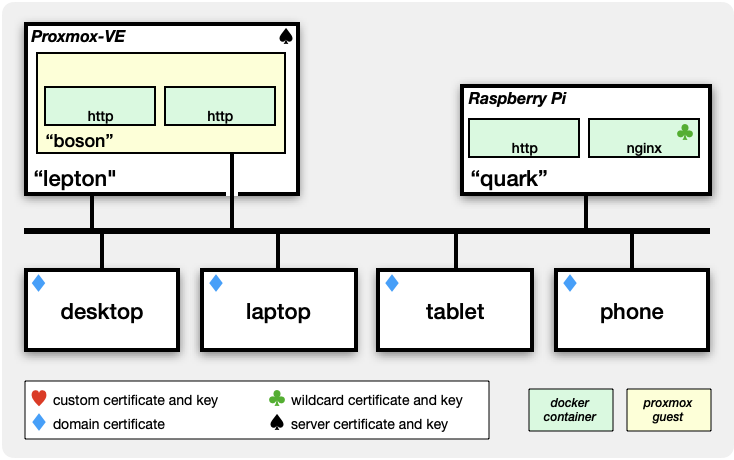

# Private SSL certificates

## scenario

You have installed an [HTTPS](https://datatracker.ietf.org/doc/html/rfc2818)-based service on your home network. You have connected to it with your browser. And you are staring at:


You may have been clicking <kbd>Show Details</kbd> and visiting the site anyway but, eventually, the alert starts to become *really* annoying.

You Google the topic and search YouTube. If your experience is anything like mine, you'll find a lot of information about registering a domain, then using [Let's Encrypt](https://letsencrypt.org) and the [ACME protocol](https://datatracker.ietf.org/doc/html/rfc8555). There is nothing wrong with that approach but it has always seemed a bit excessive if you are only running a small home network which isn't exposed to the Internet, you don't want to incur the expense of purchasing a domain, and you simply want that irritating message to go away.

That's what this repository is for:

* You can create a private [domain certificate](#domainCertificate) which you can install on each of your client systems (browsers). A single domain certificate lasts for as long as you like (the default is 10 years) and covers all of your [server](#serverCertificate) and [wildcard](#wildcardCertificate) certificates.
* You can create server certificates for your servers and wildcard certificates for your reverse proxies which you will only need to refresh every year or so.
* You won't need to register, pay for and manage an official domain. You won't need to sign-up with Let's Encrypt. And you won't need to set up an ACME client to auto-renew your certificates, nor trouble-shoot when things foul up.

As you eyeball the table of contents, you might think "too hard" but it really isn't. To the extent that there's any complexity, it's in the mechanics of installing the components on the various hosts. And that's mostly because, in the absence of any clear-cut standards, every designer of every system has invented their own way of supporting OpenSSL. Plus, even with [Let's Encrypt](https://letsencrypt.org) and [ACME](https://datatracker.ietf.org/doc/html/rfc8555), you often have to figure this bit out for yourself anyway. 

## contents

- [on the subject of …](#onTheSubject)

	- [… a Domain](#onDomain)
	- [… a DNS server](#onDNSserver)
	- [… certificates](#onCerts)

		- [certificate authority](#certificateAuthority)
		- [domain certificate](#domainCertificate)
		- [server certificate](#serverCertificate)
		- [wildcard certificate](#wildcardCertificate)

	- [… client/server roles](#onClientServer)

- [creating certificates - tutorial](#workedExample)

	- [create Certificate Authority](#makeCA)
	- [create server certificate](#makeServer)
	- [create wildcard certificate](#makeWildcard)
	- [extending the example](#extendedExample)

- [scripts reference](#scriptsReference)

	- [`make_domain_certificate.sh`](#makeCAScript)
	- [`make_server_certificate.sh`](#makeServerScript)
	- [`make_wildcard_certificate.sh`](#makeWildcardScript)
	- [Unix installation scripts](#installUnixScripts)

		- [`install_domain_certificate.sh`](#installDomainScript)
		- [`install_server_package.sh`](#installServerScript)

- [copying files to other hosts](#copyMethods)

	- [secure-shell methods](#copyViaSSH)

		- [secure copy (`scp`)](#copyViaSCP)
		- [SSH file-transfer protocol (`sftp`)](#copyViaSFTP)
		- [SSH File System (`sshfs`)](#copyViaSSHFS)

	- [network shares](#copyViaShare)
	- [email](#copyViaEMail)
	- [sneaker-net](#copyViaShoe)

- [installation procedures](#installGrabBag)

	- [Unix (Linux and macOS)](#installUnix)

		- [Client only](#installUnixClient) (just the domain certificate)
		- [Server and Client](#installUnixServer) (domain and server certificates)

	- [Linux browser examples](#linuxBrowsers)

		- [Chromium](#installChromium)
		- [Firefox](#installFirefox)

	- [Docker container examples](#dockerContainers)

		- [Node-RED](#dockerNodered)
		- [Gitea](#dockerGitea)
		- [Grafana](#dockerGrafana)
		- [Zigbee2MQTT](#dockerZigbee)

	- [iOS/iPadOS devices](#installIOSclients)
	- [Nginx (reverse proxy)](#installNginx)
	- [Proxmox-VE servers](#installProxmoxSystems)
	- [Android](#installAndroid)
	- [Windows](#installWindows)

- [useful commands](#usefulCommands)
- [see also](#seeAlso)
- [acknowledgement](#acknowledgement)
- [history](#history)

<hr>

<a name="onTheSubject"></a>
## on the subject of …

Please take the time to read this section. It explains fundamental concepts that will help you understand what the scripts do, and the purpose of the keys and certificates generated by the scripts.

<a name="onDomain"></a>
### … a Domain

You *will* need a domain but that doesn't mean you have to register and pay for an "official" domain if you don't need it for some other reason. If you already own a domain, use it. If you don't, you can either invent something unique or you can adopt the `home.arpa` domain which is reserved by [RFC8375](https://datatracker.ietf.org/doc/html/rfc8375) for exactly this kind of situation.

If you decide to use `home.arpa`, I'd recommend inventing your own sub-domain. For example, if your family name is "Williams" and you live in "Burns" street, you might choose a sub-domain like one of the following:

* `williams.home.arpa`
* `burns.home.arpa`

The examples in this document use:

* `your.home.arpa`

Substitute your own domain wherever you see that string.

<a name="onDNSserver"></a>
### … a DNS server

The need for a domain doesn't imply that you also need a Domain Name System server. SSL&nbsp;certificates can be made to work with IP addresses and hostnames in `/etc/hosts` but your life will definitely be much easier with a DNS server. A DNS server becomes almost mandatory if you want to run a reverse proxy service like Nginx.

Tip:

* If you don't have your own DNS server but it has been on your to-do list for a while, then a quick way to get started is to use [Pi-hole](https://pi-hole.net). It's not just an ad-blocker, it's also a perfectly usable DNS server.

<a name="onCerts"></a>
### … certificates

The word "certificate" gets a lot of use. In a practical sense, a certificate is the result of binding a public key with a "subject" and signing the pairing with a private key. Although you won't find all of these terms in official OpenSSL documentation, this guide uses the following definitions to try to keep the concepts clear:

* **certificate authority** <a name="certificateAuthority"></a>

	A Certificate Authority or "CA", is a standard private key generated for the sole purpose of being a CA. The private key is used to sign everything else so it is intended to be kept reasonably secure.

* **domain certificate** <a name="domainCertificate"></a>

	A domain certificate is a by-product of creating a [Certificate Authority](#certificateAuthority). It is a **domain** certificate because the "subject" is your domain (eg `your.home.arpa`). The domain certificate is signed by your CA's private key (rather than that of another authority further up the chain of trust) so it is said to be both "self-signed" and a "root certificate".

	Your CA's private key is also used to sign your **server** and **wildcard** certificates (which are discussed next). When you make your **domain** certificate available to a browser and mark the certificate trusted, the browser will implicitly trust any **server** or **wildcard** certificates that were signed by your CA.

* **server certificate** <a name="serverCertificate"></a>

	A server certificate is a non-root certificate which is signed by your [Certificate Authority](#certificateAuthority). It is a **server** certificate because the "subject" includes the valid ways by which the server can be reached, such as the server's:

	- host name (eg `boson`)
	- fully-qualified domain name (eg `boson.your.home.arpa`)
	- multicast domain name (eg `boson.local`)

	The server certificate attests that the server is what it claims to be. You install the server certificate and server private key on the server for which it was generated.

* **wildcard certificate** <a name="wildcardCertificate"></a>

	A wildcard certificate is a non-root certificate which is signed by your [Certificate Authority](#certificateAuthority). The "subject" takes the form `*.your.home.arpa` where the asterisk implies "any".

	You typically install the wildcard certificate and wildcard private key on reverse-proxy managers such as Nginx.

<a name="onClientServer"></a>
### … client/server roles

TCP/IP is a client-server model. Clients initiate "connections" while servers respond to connection requests from clients. This is true, irrespective of whether the client and server are running on the same or different hosts.

For SSL/TLS, this means that when a host is running in a:

* *client* role, it needs access to the [**domain**](#domainCertificate) certificate so it can confirm the authenticity of the *server* with which it is initiating a connection (even if that server is running on the same host);
* *server* role, it needs access to the [**server**](#serverCertificate) certificate and server private key so it can prove who it is when challenged by a *client* (even if that client is running on the same host). If a server provides reverse proxy services, it needs access to the [**wildcard**](#wildcardCertificate) certificate and wildcard private key.

In terms of TCP/IP, all computers can operate in both *client* and *server* roles. However, in the SSL/TLS context, the most common pattern you are likely to face in the average small home network is:

* your desktops, laptops and portable devices will mainly operate in *client* roles; while
* your Linux systems will mainly operate in *server* roles, unless a system is also running a desktop environment, in which case it may operate in both roles.

> I can't speak for current Windows systems but back in Mac&nbsp;OS&nbsp;X days (2015 and earlier), Macs were pretty darn good at running any service you cared to spin-up. Since then, each new macOS release has increased the level of difficulty such that it's usually simpler to run services on Raspberry Pis or Proxmox-VE guests.

<hr>

<a name="workedExample"></a>
## creating certificates - tutorial

[Figure 1](#figure1) is an example of a small home network.

| <a name="figure1"></a>Figure 1: Network Model             |
|:---------------------------------------------------------:|
| |

There are some clients (desktops, laptops, tablets, phones) running browsers, plus the following servers:

* `lepton` is a [Proxmox-VE](https://www.proxmox.com/en/products/proxmox-virtual-environment/overview) virtualization platform. Proxmox-VE includes its own web-based user interface for managing guest systems, which communicates via HTTPS on port 8006.

	The Proxmox-VE hypervisor is supervising:

	* `boson` which is a Debian guest system running two Docker containers.

* `quark` is a Raspberry Pi also running two Docker containers, one of which is the Nginx reverse-proxy manager.

The three "http" containers are intended to represent the class of containers which offer a *service* that includes some kind of web-based user interface. Such containers are usually configured to communicate via HTTP but can sometimes be reconfigured to communicate via HTTPS. Good examples are Node-RED, Grafana and Zigbee2MQTT. 

> When it comes to SSL, there are no practical differences between services which have been installed *natively*, or are running in Docker containers, nor whether those containers are operating in *host&nbsp;mode* or *non-host&nbsp;mode.*

The `nginx` container listens on three ports:

* 80 supports HTTP-based reverse-proxy services
* 443 supports HTTPS-based reverse-proxy services
* 81 is the Nginx management interface (also HTTP)

In the vast majority of home networking situations you will be able to get away with letting Nginx do almost all of the work. Nginx will present the HTTPS interface to your clients while, behind the scenes, communication will continue to occur via HTTP, just as it did before. To be able to support HTTPS, Nginx needs a wildcard certificate for your domain.

Otherwise, you will only need to generate server certificates in the following situations:

1. if a particular service **insists** on communicating **solely** via HTTPS (ie you don't have a choice in the matter); or
2. if you decide that a service should only communicate via HTTPS.

With that knowledge, you should be able to understand the deployment of the various SSL certificates in [Figure 1](#figure1):

* `lepton` needs a server certificate (<!--spade-->&#x2660;). This is because Proxmox-VE insists on communicating via HTTPS.
* the `nginx` container is a special case. It needs a wildcard certificate (<!--club-->&#x2663;).
* each client needs a domain certificate (<!--diamond-->&#x2666;). A domain certificate allows a client to establish HTTPS communications with services provisioned with server or wildcard certificates.

Let's create the certificates you need for [Figure 1](#figure1).

<a name="makeCA"></a>
### create Certificate Authority

A Certificate Authority (CA) is, essentially, a private key that can be used to sign your domain, server and wildcard certificates. To create your CA, run this command:

``` console
$ ./make_domain_certificate.sh your.home.arpa
```

The expected response is:

```
Generating a private key for your Certificate Authority
Generating self-signed root certificate for the domain: your.home.arpa
```

Your domain certificate is also created by this process. [Figure 2](#figure2) shows the directory structure.

| <a name="figure2"></a>Figure 2: File tree: Domain Certificate |
|:-------------------------------------------------------------:|
|               |

See [`make_domain_certificate.sh`](#makeCAScript) for a detailed explanation of the directory contents.

> The private key and domain certificate each contain their own copies of the public key so the absence of an explicit `.pub` should not concern you. You will see this pattern repeated for server and wildcard certificates.

The critical element is the domain certificate&nbsp;<!--A-->&#x1F150;. This single certificate will cover **all** of your servers and reverse proxies, whether they exist now or are not yet a gleam in your eye.

The domain certificate (but not the private key) must be [installed](#installGrabBag) on clients where you run a browser or other TLS-aware utilities like `curl` and `wget`. Here are some links to instructions for common examples:

* [Android](#installAndroid)
* Debian desktop systems:

	1. [Install the domain certificate](#installUnixClient); then
	2. Tell each installed browser how to access the domain certificate:

		- [Chromium browser](#installChromium) and/or
		- [Firefox browser](#installFirefox)

* [iOS devices](#installIOSclients)
* [macOS systems](#installUnixClient)
* [Windows](#installWindows)

The default lifetime of a domain certificate is 10 years so, in practice, it is likely to outlast any device on which it is deployed. 

Indeed, you can get into the habit of re-running the `make_domain_certificate.sh` script each time you get a new device. That will extend the certificate lifetime by another ten years. You only have to install the updated domain certificate on the newly-acquired device. You do **not** have to also propagate the updated domain certificate to all of your older devices because their existing domain certificates will continue to work.

Domain certificates really are set-and-forget! 

<a name="makeServer"></a>
### create server certificate

You need to generate a private key and matching server certificate for each server where:

1. You are running a web service; **and**
2. You need to use HTTPS to reach that service.

In [Figure 1](#figure1), the only candidate meeting those criteria is the Proxmox-VE server running on `lepton`. Let's create it:

``` console
$ ./make_server_certificate.sh lepton your.home.arpa
```

The expected response is:

```
Generating private key for server: lepton
Generating Certificate Signing Request (CSR)
Generating server certificate for: lepton.your.home.arpa
Certificate request self-signature ok
subject=CN=lepton.your.home.arpa
X509v3 Subject Alternative Name: 
    DNS:lepton, DNS:lepton.your.home.arpa, DNS:lepton.local, DNS:localhost
```

The last line contains important information that you would be wise to verify. When rewritten from its comma-separated form, the result is:

```
DNS:lepton
DNS:lepton.your.home.arpa
DNS:lepton.local
DNS:localhost
```

What this indicates is that the server certificate is valid for all of these URLs:

* `https://lepton` - the host's hostname&nbsp;<sup>†</sup>

	> <sup>†</sup> this assumes an entry in the client's `/etc/hosts`. It is a separate concept from the auto-appending of a search domain, which effectively converts the *hostname* form into the *fully-qualified domain name* form.

* `https://lepton.your.home.arpa` - the host's fully-qualified domain name

* `https://lepton.local` - the host's multicast domain name

* `https://localhost` - the host's loopback address


The result of creating a server certificate is shown in [Figure 3](#figure3).

| <a name="figure3"></a>Figure 3: File tree: Server Certificate |
|:-------------------------------------------------------------:|
|           |

See [`make_server_certificate.sh`](#makeServerScript) for a detailed explanation of the directory contents. The critical elements are the server certificate&nbsp;<!--B-->&#x1F151; and private key&nbsp;<!--C-->&#x1F152; which, together with the domain certificate&nbsp;<!--A-->&#x1F150;, constitute the server's installation package&nbsp;<!--D-->&#x1F153;.

Because `boson` is a Proxmox-VE server, you install the server certificate&nbsp;<!--B-->&#x1F151; and key&nbsp;<!--C-->&#x1F152; using the [Proxmox-VE user interface](#installProxmoxSystems). Once those components are in place then any client which has been provisioned with your domain certificate will be able to reach Proxmox-VE without facing a "connection is not private" challenge.

> The server's installation package&nbsp;<!--D-->&#x1F153; isn't needed for this use-case.

The default lifetime of a server certificate is two years so you will need to regenerate the certificate from time to time. Technically, you *can* create the server certificate with a longer lifetime but your browsers may complain about it.

<a name="makeWildcard"></a>
### create wildcard certificate

The `nginx` reverse proxy manager service is a special case. It needs to be provisioned with the wildcard certificate for your domain. Let's create it:

``` console
$ ./make_wildcard_certificate.sh your.home.arpa
```

The expected response is:

```
Generating private key for the wildcard domain: *.your.home.arpa
Generating Certificate Signing Request (CSR)
Generating certificate for the wildcard domain: *.your.home.arpa
Certificate request self-signature ok
subject=CN=*.your.home.arpa
```

The script creates the directory structure shown in [Figure 4](#figure4).

| <a name="figure4"></a>Figure 4: File tree: Wildcard Certificate |
|:---------------------------------------------------------------:|
|                     |

See [`make_wildcard_certificate.sh`](#makeWildcardScript) for a detailed explanation of the directory contents. The critical elements are the wildcard certificate&nbsp;<!--E-->&#x1F154; and private key&nbsp;<!--F-->&#x1F155;.

Follow the instructions to install the wildcard certificate&nbsp;<!--E-->&#x1F154; and key&nbsp;<!--F-->&#x1F155; using the [Nginx user interface](#installNginx). After that, you can start adding proxy-host definitions. Then, any client which has been provisioned with your domain certificate will be able to use HTTPS-based URLs to reach servers defined by your reverse-proxy service.

The default lifetime of a wildcard certificate is two years so you will need to regenerate the certificate from time to time. As with server certificates, you *can* create wildcard certificates with longer lifetimes but your browsers may complain if you do.

<a name="extendedExample"></a>
### extending the example

Let's move the goal-posts slightly. [Figure 5](#figure5) changes one of the HTTP containers on each server to use HTTPS.

| <a name="figure5"></a>Figure 5: Additional Certificates  |
|:--------------------------------------------------------:|
|  |
| <sup>†</sup> same certificate as already used on `quark` |

Grafana is an example of a container which can be adapted to use HTTPS via a server certificate which was constructed for the host on which the container is running. To put this another way, if you have two or more such containers running on the same host, they can all use the same server certificate.

Gitea, on the other hand, is an example of a container that makes it hard (but not impossible) to use a server certificate which was constructed for the host on which it is running. Fortunately, Gitea comes with built-in facilities for generating and maintaining its own container-specific certificates. The [IOTstack wiki for Gitea](https://sensorsiot.github.io/IOTstack/Containers/Gitea/) contains the necessary instructions.

So that leaves Grafana, which means we need a server certificate for `boson`:

``` console
$ ./make_server_certificate.sh boson your.home.arpa
```

Recall that the server certificate for `lepton` was installed using the Proxmox-VE GUI. In this use-case, we are going to use the command line. The [installation process](#installUnixServer) begins with copying two files to `boson`:

* an installer script named [`install_server_package.sh`](#installServerScript); plus
* the server's installation package (refer &nbsp;<!--D-->&#x1F153; in [Figure&nbsp;3](#figure3)).

You then [run the installer script](#installUnixServer) on `lepton`.

Once the server certificate is in place, you need to make adjustments to Grafana's service definition. The instructions are [here](#dockerGrafana).

Please keep in mind that implementing HTTPS on both Grafana and Gitea was a **choice**. Both services would have continued to work quite happily using HTTP, with Nginx providing an HTTPS front end to each. In reality, the only time you will need more than domain and wildcard certificates is if HTTPS is forced on you (like Proxmox-VE) or **you** decide to do it.

<a name="scriptsReference"></a>
## scripts reference

<a name="makeCAScript"></a>
### make&#x005F;domain&#x005F;certificate.sh

This command creates a Certificate Authority for your domain. The usage is:

``` console
$ {DAYS=«days»} ./make_domain_certificate.sh «domain»
```

You should run this script before you run any of the other scripts.

The first time you run this script, it creates a "domain directory" which is named for your `«domain»`, plus a sub-directory named "CA". The script then generates a private key for your Certificate Authority (CA) plus a self-signed domain certificate.

See [Figure 2](#figure2) for an example of the contents of a CA directory.

The `CA` directory contains files with the following extensions:

* `.crt` is the self-signed domain certificate. It is in Privacy Enhanced Mail (PEM) format.
* `.der` is a copy of the `.crt` converted to Distinguished Encoding Rules (DER) format.

	> The `.der` is a convenience and should only be used if your client system won't accept the `.crt`. Otherwise, it should be ignored.

* `.key` is the PEM-format private key associated with your Certificate Authority. This file should be kept reasonably secure.
* `.srl` is used by OpenSSL for managing serial numbers. You should leave this file alone.

The `.crt` file should be installed on any client machine with a browser which will connect to any of your servers. How you install this certificate depends on the operating system. In reality, the situation is a bit of a mess but the section on [installation procedures](#installGrabBag) should get you started.

Providing you don't delete the private key, you can re-run this script to extend the lifetime of your domain certificate.

The default lifetime of the domain certificate created by this script is 3650 days (ten years). You can, if you wish, set a different lifetime via the `DAYS` environment variable. For example, to set a lifetime of one year:

``` console
$ DAYS=365 ./make_domain_certificate.sh your.home.arpa
```

All that happens is the validity period of the domain certificate changes to start from "now" and expire after as many days as you specify. Any value you set for `DAYS` is cached and will be re-used until you change the value again.

<a name="makeServerScript"></a>
### make&#x005F;server&#x005F;certificate.sh

This command creates the required files for installation on one of your servers. It must be run **after** `make_domain_certificate.sh`. The usage is:

``` console
$ {DAYS=n} make_server_certificate.sh hostname domain {name | IP ...}
```

The `«hostname»` should match whatever the target server reports when you run:

``` console
$ hostname -s
```

The first time you run this script, it creates a `servers` directory, plus a sub-directory which is named for `«hostname»`. The script then generates a private key for your server, plus a server certificate which is signed by your Certificate Authority's private key.

See [Figure 3](#figure3) for examples of the contents of server directories. Each sub-directory in the `servers` directory contains the following files:

* `.days` is the cached server certificate lifetime (in days).
* `.subject-alt-names` is a cached list of subject alternative names. It will only be present if you pass additional `«name»` or `«IP»` arguments on the command line.
* `«hostname».key` is a PEM-format private key.
* `«hostname».crt` is a PEM-format server certificate, signed by your Certificate Authority.
* `«hostname».csr` is an intermediate file containing the certificate signing request. You should leave this file alone.
* `«hostname»_etc-ssl.tar.gz` is a compressed tape archive containing:

	- `«hostname».crt` is the server's certificate
	- `«hostname».key` is the server's private key
	- `«domain».crt` is the domain certificate

The default lifetime of a certificate created by this script is 730 days. You can set a different certificate lifetime if you wish. For example, to set a lifetime of 90 days:

``` console
$ DAYS=90 ./make_server_certificate.sh «hostname» «domain»
```

You should choose a lifetime within the range 1…825 days. Your certificate may not work if you set a value shorter than 1 day. If you set a lifetime longer than 825 days (2 years, 3 months) your browser may complain that your certificate is not standards compliant.

The certificate lifetime (whether the default value or a different value specified by you) is recorded in the `.days` cache. The cached value is then re-used until you specify a different value.

The "subject alternative names" is a list of IP addresses and/or domain names for which the certificate is authoritative. The default set is the network names via which the server is reachable:

* `«hostname»` the (short) host name
* `«hostname».«domain»` the fully-qualified domain name
* `«hostname».local` the multicast DNS name

You can augment this list if necessary to include the host's IP address(es) and other domain names via which the server is reachable.

Any time you augment the list, the result is recorded in the `.subject-alt-names` cache. The cached values are then re-used until you specify different values. In advanced situations you can hand-edit the cache and then run the script to generate a certificate according to your needs (eg omitting some of the standard defaults).

Providing you don't delete anything in a server's sub-directory, you can re-run the same command to alter certificate parameters or extend the certificate's lifetime. For example, the following command simply extends the certificate's lifetime:

``` console
$ ./make_server_certificate.sh lepton your.home.arpa
```

Assuming the cached certificate lifetime was 730 days, the new certificate will have the same subject alternative names as its predecessor but its lifetime will be from "now" to "730 days hence".

The [`install_server_package.sh`](#installServerScript) script installs the contents of the `.tar.gz` on the server for which the server certificate was generated. 

<a name="makeWildcardScript"></a>
### make&#x005F;wildcard&#x005F;certificate.sh

This command creates the required files for a wildcard certificate. It must be run **after** `make_domain_certificate.sh`. The usage is:

``` console
$ {DAYS=n} ./make_wildcard_certificate.sh «domain»
```

The first time you run this script, it generates a private key for your wildcard, plus a wildcard certificate for your domain which is signed by your Certificate Authority. The wildcard takes the form:

```
*.your.home.arpa
```

You can only have a single level of wildcard so it follows that you can have exactly one wildcard certificate per domain. This is reflected in the fact that the generated files are stored in a dedicated `wildcard` sub-directory of your `«domain»` directory. Otherwise, with the exception of the `.tar.gz` which is not generated for wildcards, the files have the same extensions and meanings as [server certificates](#makeServerScript).

See [Figure 4](#figure4) for an example of the contents of a wildcard directory.

A typical application for a wildcard certificate is a reverse proxy service such as Nginx.

The wildcard certificate lifetime is handled in the same way as was explained for [`make_server_certificate.sh`](#makeServerScript).

The subject alternative names for a wildcard certificate are fixed at `*.«domain»` and `*.local`.

Providing you don't delete anything in the wildcard sub-directory, you can re-run the same command to extend the wildcard certificate's lifetime. For example, the following command simply extends the certificate's lifetime:

``` console
$ ./make_wildcard_certificate.sh your.home.arpa
```

Assuming the cached certificate lifetime was 730 days, the new certificate's lifetime will be from "now" to "730 days hence".

<a name="installUnixScripts"></a>
### Unix installation scripts

The scripts in this section have been tested on Debian, macOS and Ubuntu. They have had limited testing on Alpine but have not been tested on other Linux distributions. The scripts will not run on non-Unix systems.

> As a general statement, these scripts will probably run on CoreOS and SUSE but won't run on other Linux distros. The main issue is the `update-ca-certificates` command not being available on those other distros. See the very useful discussion at this [GitHub repo](https://github.com/millermatt/osca) if you need to tailor these scripts.

These scripts have dependencies which you should check before running them for the first time:

* on the supported Linux distros:

	``` console
	$ sudo apt update
	$ sudo apt install -y gnutls-bin p11-kit p11-kit-modules libnss3-tools ca-certificates
	```

* on MacOS (assuming [HomeBrew](https://brew.sh) is installed):

	``` console
	$ brew update
	$ brew install coreutils
	```

You must be an administrator with the ability to run `sudo`. If your system is configured to prompt for a password when the `sudo` command is used, you can expect that to happen.

On macOS, you can also expect to have to respond to a security dialog when the script tries to add the trusted domain certificate to your keychain.

<a name="installDomainScript"></a>
#### install&#x005F;domain&#x005F;certificate.sh

This script assumes that you want to run your Unix system in a client role only, which means only the domain certificate is needed.

> The [`install_server_package.sh`](#installServerScript) discussed below installs both your domain certificate **and** your server certificate and key so you do **not** need to run **both** of these scripts. The main reason this script exists is to avoid you having generate a server certificate for every client, just to get the domain certificate installed.

Preconditions:

1. This script, plus the *domain certificate* for the target host must be present in the working directory. The expected filename pattern for the certificate is:

	```
	«domain».crt
	```

	where `«domain»` is the value you get from running the following command on the target client system:

	``` console
	$ hostname -d
	```

	See [methods for copying files to other hosts](#copyMethods). There is a practical example [here](#installUnixClient).

2. The subject of the domain certificate contained within the *installation package* must also match your `«domain»`.

Usage:

``` console
$ {DOMAIN=«domain»} ./install_domain_certificate.sh
```

If you encounter a situation where `hostname -s` does not match the name you used when generating the server certificate, you can force the installation like this:

``` console
$ DOMAIN=«domain» ./install_domain_certificate.sh
```

Script behaviour depends on your operating system:

* on supported Linux systems, the domain certificate is copied to the path:  

	```
	/usr/local/share/ca-certificates/«domain»/«domain».crt
	```

	After that, the command `update-ca-certificates` is run, which propagates your domain certificate into `/etc/ssl/certs`. This allows the host to act in a *client* role when using commands like `curl` and `wget` in conjunction with TLS-based protocols, which all seem to work out of the box.

	Linux browsers generally need additional configuration before they will adopt a custom domain certificate. For examples, see:

	* [Firefox](#installFirefox); and
	* [Chromium](#installChromium)

* on macOS hosts, providing the incoming domain certificate is not already resident in your user keychain, it will be added and marked trusted. Unfortunately, the macOS keychain will happily accept duplicate domain certificates, providing they have different expiration dates. There seems to be no way of automating the removal of superseded or expired domain certificates, which means it is left up to you to do using the macOS "Keychain Access" application. The script does, however, let you know how many such duplicates exist.

	All macOS browsers seem to work out of the box. I have tested Safari, Chrome, Chromium-Gost, and Firefox.

	Some TLS-aware command-line utilities can also use a domain certificate resident in your keychain while other tools can be a bit hit and miss. Examples include the HomeBrew versions of `curl` and `wget`. This script solves that problem by adding the necessary directives to `~/.curlrc` and `~/.wgetrc`.

	If you come across another TLS-aware tool that doesn't respect the domain certificate in your keychain, you will have to figure out a similar solution.

<a name="installServerScript"></a>
#### install&#x005F;server&#x005F;package.sh

The script assumes that you may wish to run your Unix system in **both** client and server roles. The former role needs the domain certificate while the latter needs the server certificate and key. The script installs all three. If you **only** need your Unix system to run in a client role, you should use the [`install_domain_certificate.sh`](#installDomainScript) script discussed above.

Preconditions:

1. This script, plus the *installation package* for the target host must be present in the working directory. The expected filename pattern for the package is:

	```
	«hostname»_etc-ssl.tar.gz
	```

	where `«hostname»` is the value you get from running the following command on your server:

	``` console
	$ hostname -s
	```

	See [methods for copying files to other hosts](#copyMethods). There is a practical example [here](#installUnixServer).

2. The subject of the server certificate contained within the *installation package* must also match `«hostname»`. In other words, if you rename a host you **must** generate a new server certificate using the new name. You can't just rename the files.

Usage:

``` console
$ {SERVER_HOSTNAME=«hostname»} ./install_server_package.sh
```

If you encounter a situation where `hostname -s` does not match the name you used when generating the server certificate, you can force the installation like this:

``` console
$ SERVER_HOSTNAME=«hostname» ./install_server_package.sh
```

[Figure 10](#figure10) summarises what is installed.

| <a name="figure10"></a>Figure 10: Unix Certificates Installation |
|:----------------------------------------------------------------:|
|      |

This structure provides the necessary framework for most situations:

* server roles need access to the server certificate&nbsp;<!--B-->&#x1F151; and server private key&nbsp;<!--C-->&#x1F152; This is the case irrespective of whether a service is running in a container or has been installed natively.
* client roles need access to the domain certificate&nbsp;<!--A-->&#x1F150; but the certificate *in this location* is primarily intended for a container running its own client, such as a health-check service that relies on `curl` or `wget`.

The domain certificate ***in this location*** is (mostly) not useful for other client usages, such as browsers and command-line utilities like `curl` or `wget`. For those *other* client usages, the script also installs your domain certificate in the operating system's standard location. In this respect, the script's behaviour is identical to [`install_domain_certificate.sh`](#installDomainScript).

Please note the presence of symbolic links in [Figure 10](#figure10). Your domain certificate will have a name like `your.home.arpa.crt` while your server certificate and key will be named for your host (eg `lepton.crt` and `lepton.key`). I recommend using the machine-independent symbolic links (`domain.crt`, `localhost.crt` and `localhost.key`). That way, any absolute paths embedded in Docker service definitions or configuration files will be portable.

Re-running this script always replaces any prior versions of the files in [Figure 10](#figure10), irrespective of whether the *installation package* actually contains newer files.

<a name="copyMethods"></a>
## copying files to other hosts

One of the things you need to get comfortable with is moving files from your *support host* (the computer where you generate your certificates) onto the *target host* (the computer where the certificates need to be installed). The choice of method is up to you.

<a name="copyViaSSH"></a>
### secure-shell (SSH) methods

The options here include:


* the `scp` ("secure copy") command where the basic syntax is <a name="copyViaSCP"></a>:

	``` console
	$ scp «file» {«file» ...} «user»@«target».«domain»:.
	```

	The `«file»` argument can be repeated to transfer multiple files to the destination host.


* the `sftp` ("SSH file-transfer protocol") command where the basic syntax is <a name="copyViaSFTP"></a>:

	``` console
	$ sftp «user»@«target».«domain»:.
	sftp> put «file1»
	sftp> put «file2»
	sftp> bye
	$
	```

	Note the multiple `put` commands. Unlike with `scp`, you can't use `sftp` to transfer multiple files using a single `put` command. For example:

	``` console
	sftp> put «file1» «file2»
	```

	copies `«file1»` from the local host, giving it the name `«file2»` on the remote host.


* network shares using `sshfs` (the "SSH File System") <a name="copyViaSSHFS"></a>:

	``` console
	$ MOUNTPOINT="$HOME/remote"
	$ mkdir -p "$MOUNTPOINT"
	$ sshfs «user»@«target».«domain»:. "$MOUNTPOINT" -ovolname="«target»"
	```

	Once the volume is mounted, you can drag-and-drop like any other network share.

Notes:

1. If you have already set up password-less SSH then the instances of:

	```
	«user»@«target».«domain»
	```

	will reduce to just:

	```
	«target»
	```

	For more information, see:

	* [`ssh-keygen` plus `ssh-copy-id` example](https://github.com/Paraphraser/IOTstackBackup/blob/master/ssh-tutorial.md)
	* [SSH certificates](https://github.com/Paraphraser/ssh-certificates)

2. In each case, the `:` (colon) separates the host specification from the remote path specification. The colon separator is required for `scp` and `sshfs` but can be omitted for `sftp`.
3. The trailing `.` implies the home directory of `«user»` on the `«target»` host. You can replace `.` with a path to another directory on the remote host. If a path does not start with `/` it is assumed to be relative to the user's home directory.

<a name="copyViaShare"></a>
### network shares

Other network share services such as Samba, the setup and usage of which is beyond the scope of this document.

<a name="copyViaEMail"></a>
### email

Email can be used, providing both the sending and receiving device are configured appropriately. This is the recommended method for deploying domain certificates on iOS devices.

<a name="copyViaShoe"></a>
### sneaker-net

*Sneaker-net* is the option of last resort, where you use removable media like a "thumb" drive.

<a name="installGrabBag"></a>
## installation procedures

This section is a grab-bag of installation methods in no particular order. As noted in the introduction, the variety of approaches and lack of consistency is largely the result of the absence of clear standards underpinning OpenSSL.

<a name="installUnix"></a>
### Unix (Linux and macOS)

The procedure you need to follow depends on whether your target host is:

* **only** a client running browsers and TLS-aware command-line tools; or
* runs one or more HTTPS services.

Although it will do no harm if you follow both procedures on any given target host, it is not necessary. The [SSL client only](#installUnixClient) procedure exists to save you from needing to generate server certificates for hosts that don't actually offer any HTTPS services.

<a name="installUnixClient"></a>
#### Client only

If the target host only needs to behave as a **client** (ie run a browser or use TLS-aware command line utilities like `curl` and `wget`) then you should:

1. Use one of the [copy methods](#copyMethods) to copy these files to the target host:

	* `install_domain_certificate.sh` (installation script)
	* `«domain».crt` (domain certificate&nbsp;–&nbsp;refer &nbsp;<!--A-->&#x1F150; in [Figure&nbsp;2](#figure2))

2. Connect to the host (eg open a terminal window or use SSH).

3. Run the installation script:

	``` console
	$ ./install_domain_certificate.sh
	```

	See [`install_domain_certificate.sh`](#installDomainScript) for more information on this script.

<a name="installUnixServer"></a>
#### Server and Client

If the target host is running HTTPS-based **services** which need access to a custom server certificate then you should: 

1. Use one of the [copy methods](#copyMethods) to copy these files to the target host:

	* `install_server_package.sh` (installation script)
	* `«server»_etc-ssl.tar.gz` (installation package&nbsp;–&nbsp;refer &nbsp;&nbsp;<!--D-->&#x1F153; in [Figure&nbsp;3](#figure3))

2. Connect to the host (eg open a terminal window or use SSH).

3. Run the installation script:

	``` console
	$ ./install_server_package.sh
	```

	See [`install_server_package.sh`](#installServerScript) for more information on this script. This script also installs your domain certificate so you do not need the [SSL Client only](#installUnixClient) procedure as well.

<a name="linuxBrowsers"></a>
### Linux browser examples

<a name="installChromium"></a>
#### Chromium

Chromium is not always pre-installed on Linux:

``` console
$ sudo apt update
$ sudo apt install -y chromium
```

Chromium (on Linux) maintains its own trust store so you need to tell it to import its own copy of your domain certificate. The instructions here assume you have already run one of the installation scripts. On Linux that places your domain certificate in the following directory:

```
/usr/local/share/ca-certificates
```

[Figure 6](#figure6) summarises the configuration process for the Chromium browser.

| <a name="figure6"></a>Figure 6: Debian+Chromium browser installation    |
|:-----------------------------------------------------------------------:|
| |

1. Launch Chromium.
2. Click <kbd><!--v.ellipsis-->&#x22EE;</kbd>&nbsp;<!--A-->&#x1F130; at the end of the URL bar and choose "Settings"&nbsp;<!--B-->&#x1F131;.
3. From the side-bar, choose "Privacy and security"&nbsp;<!--C-->&#x1F132;.
4. Click the "Security" grouping&nbsp;<!--D-->&#x1F133;.
5. Scroll down until you see "Manage certificates"&nbsp;<!--E-->&#x1F134; then click on that grouping.
6. Click on the "Authorities" tab&nbsp;<!--F-->&#x1F135;.
7. Click <kbd>Import</kbd>&nbsp;<!--G-->&#x1F136; and navigate to:

	* `/usr/local/share/ca-certificates/`&nbsp;<!--H-->&#x1F137;

8. Select your domain certificate (eg `your.home.arpa.crt`)&nbsp;<!--I-->&#x1F138; and click <kbd>Select</kbd>&nbsp;<!--J-->&#x1F139;.
9. Turn on the "Trust this certificate for identifying websites" option&nbsp;<!--K-->&#x1F13A;, then click <kbd>OK</kbd>&nbsp;<!--L-->&#x1F13B;.

The domain certificate is now installed and trusted&nbsp;<!--M-->&#x1F13C;.

See also:

* [Chromium Certificate Management](https://chromium.googlesource.com/chromium/src.git/+/refs/heads/main/docs/linux/cert_management.md)

<a name="installFirefox"></a>
#### Firefox

Firefox is usually pre-installed on desktop systems. The instructions here assume you have already run one of the installation scripts and explain how to configure Firefox to use the standard certificate store.

Begin by running the following command in a Terminal window:

``` console
$ dpkg --listfiles p11-kit-modules | grep trust
``` 

The expected response is:

```
/usr/lib/x86_64-linux-gnu/pkcs11/p11-kit-trust.so
```

If you get a different answer, make a note of the path because you will need it later. The steps are:

1. Click the&nbsp;<!--hamburger-->&#x2630; icon ("Open Application Menu") and choose "Settings".
2. Choose "Privacy & Security".
3. Scroll down to "Security". Find and click <kbd>Security Devices...</kbd>.
4. Click <kbd>Load</kbd>.
5. Enter a name for the module like "local trust".
6. Click <kbd>Browse...</kbd>.
7. Choose "Other Locations", then choose "This Computer".
8. Navigate to the `/usr/lib/x86_64-linux-gnu/pkcs11` directory, select `p11-kit-trust.so` and click <kbd>Open</kbd>.

	> On smaller screens you may need to click "Activities" on the menu bar to cause the dialog from the prior step to become available as a thumbnail, after which you can select it so it is brought to the front.

9. Click <kbd>OK</kbd> to load the driver.
10. Click <kbd>OK</kbd> to close the Device Manager.
11. Close all open windows or tabs (which causes Firefox to quit).

When you re-launch Firefox it will have access to your domain certificate.

See also:

* [Firefox Private Certificate Authority](https://wiki.debian.org/Firefox/PrivateCertificateAuthority)

<a name="dockerContainers"></a>
### Docker container examples

This discussion is confined to Docker containers running on Linux hosts. *Some* of it may be applicable to Docker Desktop environments on macOS or Windows but I have not tested that.

As a rule of thumb, it is usually better to allow containers to work "as supplied" (which normally means HTTP) and use a reverse proxy such as Nginx to present the HTTPS interface to clients. If you accept this advice you will minimise the extent to which you need to deploy server certificates, and avoid the need to tailor container service definitions and configuration files.

However, assuming you intend to *ignore* that advice&nbsp;…

Although Docker containers behave like a small independent computers with their own operating systems, hostnames and (if running in non-host mode) IP addresses, it's the perspective of the **client** that actually matters for SSL. The **client** needs to be assured that it's communicating with the **host**, not something running on the host. That's why, in general, it's the **host** that needs a server certificate, rather than each HTTPS container. 

That said, every container is unique. Some support HTTPS, some don't. For those that do, the implementation mechanisms differ. Some expect you to provide the certificate; others include their own certificate-generation capabilities. Activating HTTPS on a container typically involves some combination of:

1. An additional bind-mount, to give the container access to the server certificate and key of the host on which the container is running.

2. Environment variables and/or edits to configuration files, to tell processes running inside the container where to find the server certificate and key.

Nginx is a special case which needs to be [provisioned](#installNginx) with your wildcard certificate and key. We'll ignore it for now.

Assuming you have performed the [SSL Server and Client](#installUnixServer) procedure **and** that you accept the recommendation to use the machine-independent symbolic links, your starting point is:

* `/opt/local/etc/openssl/certs/domain.crt` (domain certificate)
* `/opt/local/etc/openssl/certs/localhost.crt` (server certificate)
* `/opt/local/etc/openssl/private/localhost.key` (server key)

The container will need access to those files and the simplest way to accomplish that is with a bind-mount added to the container's service definition:

``` yaml
volumes:
  - /opt/local/etc/openssl:/opt/local/etc/openssl:ro
```

> Before adding a new bind-mount specification to a container, it is a good idea to go into the container to see whether it already defines the internal (right-hand-side) path. If it does, replace the right-hand-side path with something unique and adapt these instructions accordingly.

The container then needs to be told to use:

* the server certificate at `/opt/local/etc/openssl/certs/localhost.crt`
* the server private key at `/opt/local/etc/openssl/private/localhost.key`

Any internal clients (eg health-check services) have the domain certificate available at:

* `/opt/local/etc/openssl/certs/domain.crt`

One possible fly in the ointment is if you have a container which either launches non-root (ie a `user:` clause) or launches as root (the default) but downgrades its privileges at runtime. Please study [Figure 10](#figure10). Although the domain and server certificates are world-readable, the server private key is not. This implements best practice for the protection of private keys.

If this causes a problem you can either relax the permissions on your system, or copy the private key into the scope of the problematic container and set appropriate permissions there.

Note:

* Once the structures in `/opt/local/etc/openssl/private` have been established, re-running the [installer script](#installServerScript) will not alter either ownership or permissions.

<a name="dockerNodered"></a>
#### Node-RED

Node-RED is an example of a container where HTTPS is activated by editing its configuration file. You need to:

1. Add the bind-mount explained above to the service definition:

	``` yaml
	volumes:
	  - /opt/local/etc/openssl:/opt/local/etc/openssl:ro
	```

2. Edit `settings.js` to:

	* activate the `fs` module (near the top of the file); and
	* uncomment and edit this block of JSON:

		``` JSON
		https: {
		    key: fs.readFileSync('/opt/local/etc/openssl/private/localhost.key'),
		    cert: fs.readFileSync('/opt/local/etc/openssl/certs/localhost.crt')
		}, 
		```

3. Recreate the container:

	``` console
	$ docker compose up -d nodered
	```

4. If you need to re-edit `settings.js` for any reason (eg to fix a typo), an `up` command will not work. You need to restart the container:

	``` console
	$ docker compose restart nodered
	```

Note:

* The IOTstack service definition for Node-RED includes a [`user: "0"`](https://github.com/SensorsIot/IOTstack/blob/940f96b74689353047d75e42380f6688b0ce48c4/.templates/nodered/service.yml#L9) clause which forces the container to launch and run as root. This was done for other reasons but it has the beneficial side-effect of giving the container access to the server private key.

<a name="dockerGitea"></a>
#### Gitea

Gitea is an example of a container that can generate its own certificates. This means:

1. The service definition does not need access to `/opt/local/etc/openssl`;
2. The self-signed certificate generated by the container pulls double duty as both the certificate authority certificate and server certificate; and
3. The `healthcheck` clause needs to reference the container by its name (`gitea`) rather than relying on `localhost`.

The practical consequence of this arrangement is that it is only really useful (in the sense of SSL working properly) if the **service** domain name (eg `gitea.your.home.arpa`) is an alias (CNAME) pointing to either:

* the host on which the Gitea service is running; or
* the host on which a reverse proxy like Nginx is running.

See [IOTstack Gitea](https://sensorsiot.github.io/IOTstack/Containers/Gitea/) for detailed configuration instructions.

<a name="dockerGrafana"></a>
#### Grafana

The [IOTstack service definition for Grafana](https://github.com/SensorsIot/IOTstack/blob/master/.templates/grafana/service.yml) is an example of a container with its own client (`healthcheck` clause), but which does not have its own certificate-generation capabilities, and where HTTPS activation is controlled by environment variables.

Recall that the reason why a container uses the certificate and key of the host on which it is running is because it is the perspective of the client that matters. Most clients are external so their perspective is that they are communicating with the host, not the container.

Conversely, when a client is internal to the container, its perspective is that it is communicating with the container, not the host on which the container is running.

Assumptions:

1. Grafana is running on `boson` in [Figure 5](#figure5);
2. A server certificate was generated for `boson`; and
3. The server package was installed. 

Procedure:

1. Give the container access to the certificates by adding the required bind-mount to the Grafana service definition:

	``` yaml
	volumes:
	  - /opt/local/etc/openssl:/opt/local/etc/openssl:ro
	```

4. Activate HTTPS on the Grafana container:

	``` yaml
	environment:
	  - GF_SERVER_CERT_KEY=/opt/local/etc/openssl/private/localhost.key
	  - GF_SERVER_CERT_FILE=/opt/local/etc/openssl/certs/localhost.crt
	  - GF_SERVER_PROTOCOL=https
	```

	Grafana (the process) now knows where to find the augmented server certificate and key.

5. The baseline IOTstack health-check is defined like this:

	``` yaml
	healthcheck:
	  test: ["CMD", "wget", "-O", "/dev/null", "http://localhost:3000"]
	  interval: 30s
	  timeout: 10s
	  retries: 3
	  start_period: 30s
	```

	Issues with the specified `test:` include:

	* `http` is the wrong protocol. It needs to be `https`.
	*  Grafana is built on Alpine. The `wget` utility supplied with Alpine isn't fully TLS-aware  so `curl` is the better choice.
	*  Seeing as we're here, we may as well update the syntax too.

	Replacement test:

	``` yaml
	  test: ["CMD-SHELL", "curl -sf4 --cacert /opt/local/etc/openssl/certs/domain.crt -o /dev/null https://localhost:3000"]
	```

	In this context, 3000 is the internal (container) port.

6. Recreate the container:

	``` console
	$ docker compose up -d grafana
	```

With this structure in place, you can expect the following tests to succeed:

1. Execution within the container:

	``` console
	$ docker exec grafana curl -f4 --cacert /opt/local/etc/openssl/certs/domain.crt -o /dev/null https://localhost:3000
	```

	Here, `localhost` means "this container" so `3000` is the internal port.

2. Execution on the host on which the container is running:

	``` console
	$ curl -f4 -o /dev/null https://localhost:3000
	```

	In this case, `localhost` means "this host" so `3000` is the external port. The `--cacert` option isn't needed because `curl` uses the host's certificate store in `/etc/ssl`.

3. Using the fully-qualified domain name of the **host** where Grafana is running:

	``` console
	$ curl -f4 -o /dev/null https://boson.your.home.arpa:3000
	```

	This works from any host where the domain certificate is available.

4. Using the fully-qualified domain name of the Grafana **service**.

	``` console
	$ curl -f4 -o /dev/null https://grafana.your.home.arpa
	```

	In this form, `https` defaults to port 443. `grafana.your.home.arpa` is assumed to point to your Nginx proxy, which sends the traffic back to `boson` on port 3000.

<a name="dockerZigbee"></a>
#### Zigbee2MQTT

Zigbee2MQTT is similar to Grafana. All HTTPS-related configuration is done via environment variables.

Procedure:

1. Add the bind-mount explained above to the service definition:

	``` yaml
	volumes:
	  - /opt/local/etc/openssl:/opt/local/etc/openssl:ro
	```

2. By default, Zigbee2MQTT listens for HTTP communication on port 8080. However, the port switches to HTTPS if you define the following environment variables:

	``` yaml
	environment:
	- ZIGBEE2MQTT_CONFIG_FRONTEND_SSL_KEY=/opt/local/etc/openssl/private/localhost.key
	- ZIGBEE2MQTT_CONFIG_FRONTEND_SSL_CERT=/opt/local/etc/openssl/certs/localhost.crt
	```

3. Recreate the container:

	``` console
	$ docker compose up -d zigbee2mqtt
	```

<a name="installIOSclients"></a>
### iOS/iPadOS devices

The simplest way to get started is to email your domain certificate (eg `your.home.arpa.crt`) to a mailbox that you can access from your iOS device. This will often be your iCloud account.

[Figure 7](#figure7) summarises the installation process.

| <a name="figure7"></a>Figure 7: iOS installation - starting from Mail |
|:---------------------------------------------------------------------:|
|           |

The steps are:

1. Launch Mail&nbsp;<!--A-->&#x1F130; and select the account to which you sent the domain certificate.
2. Select the message&nbsp;<!--B-->&#x1F131; containing the attached domain certificate, then tap on the attachment's icon&nbsp;<!--C-->&#x1F132; (not the download symbol). iOS responds with a dialog telling you that a profile has been downloaded. Tap <kbd>Close</kbd>&nbsp;<!--D-->&#x1F133;.
3. Switch to the System Settings app&nbsp;<!--E-->&#x1F134;. Near the top of the left-hand panel is a temporary category named "Profile Downloaded"&nbsp;<!--F-->&#x1F135;. Tap that.
4. A sheet slides in where you can see the certificate details. Tap the <kbd>Install</kbd> button&nbsp;<!--G-->&#x1F136; and follow the process to completion by tapping <kbd>Install</kbd> three more times (<!--H-->&#x1F137;,&nbsp;<!--I-->&#x1F138; and&nbsp;<!--J-->&#x1F139;). Depending on your settings, iOS may prompt you to authenticate.
5. At the top level of of "System Settings", tap <kbd>General</kbd>&nbsp;<!--K-->&#x1F13A;, then <kbd>About</kbd>&nbsp;<!--L-->&#x1F13B;.
6. Find and tap <kbd>Certificate&nbsp;Trust&nbsp;Settings</kbd>&nbsp;<!--M-->&#x1F13C; (it's near the bottom of the list).
7. A sheet opens where you can see the name of the domain certificate you have just installed. Turn on the switch&nbsp;<!--N-->&#x1F13D; and acknowledge the alert&nbsp;<!--O-->&#x1F13E; to enable full trust. Depending on your settings, iOS may also prompt you to authenticate.

<a name="installNginx"></a>
### Nginx (reverse proxy)

The instructions in this section assume you have previously installed and initialised your [Nginx container](https://nginxproxymanager.com), and are able to login.

At the time of writing, [Pull Request 802](https://github.com/SensorsIot/IOTstack/pull/802) had been submitted to add Nginx to IOTstack. Once that is approved, the documentation should appear [here](https://sensorsiot.github.io/IOTstack/Containers/Nginx/). In the meantime:

* [Documentation](https://github.com/SensorsIot/IOTstack/blob/6865efa9e7ec2170c7c0cec7ef241f5ec07f9782/docs/Containers/Nginx.md)
* [Service definition](https://github.com/SensorsIot/IOTstack/blob/6865efa9e7ec2170c7c0cec7ef241f5ec07f9782/.templates/nginx/service.yml)

[Figure 8](#figure8) summarises the wildcard certificate installation process using the web GUI.

| <a name="figure8"></a>Figure 8: Nginx Proxy Manager - add via GUI |
|:-----------------------------------------------------------------:|
|   |

The steps are:

1. Connect to the Nginx server GUI on port 81 (HTTP). For example:

	```
	http://quark.your.home.arpa:81
	```

2. Login using your credentials. 
3. Switch to the "SSL Certificates" tab&nbsp;<!--A-->&#x1F130;.
4. Click <kbd>Add SSL Certificate</kbd>&nbsp;<!--B-->&#x1F131; and choose "Custom"&nbsp;<!--C-->&#x1F132; from the popup menu.  
5. Type a name for your certificate at&nbsp;<!--D-->&#x1F133;. It might help you to remember that it is a wildcard certificate if you use a name like "wildcard" or "*.your.home.arpa".
6. Click <kbd>Browse</kbd>&nbsp;<!--E-->&#x1F134;, then navigate to and select the `wildcard.key` file.
7. Click <kbd>Browse</kbd>&nbsp;<!--F-->&#x1F135;, then navigate to and select the `wildcard.crt` file.
8. Ignore the "Intermediate Certificate" field.
9. Click <kbd>Save</kbd>&nbsp;<!--G-->&#x1F136;.
10. The newly-added certificate appears in the list at&nbsp;<!--H-->&#x1F137;.
11. You can start using the certificate in the "Hosts" tab&nbsp;<!--J-->&#x1F139;.

<a name="installProxmoxSystems"></a>
### Proxmox-VE servers

Although Proxmox-VE is based on Debian, it is treated here as a special case.

[Figure 9](#figure9) summarises the certificate installation process using the web GUI.

| <a name="figure9"></a>Figure 9: Proxmox-VE - add via GUI |
|:--------------------------------------------------------:|
|    |

The steps are:

1. Connect to the server on port 8006. Push past any SSL/TLS security alert and login to the Proxmox-VE server GUI as the root user.
2. Switch to "Server View"&nbsp;<!--A-->&#x1F130; then expand the "Datacenter"&nbsp;<!--B-->&#x1F131; and click on the name of your server&nbsp;<!--C-->&#x1F132; to select it.
3. In the middle panel, find the "System" group&nbsp;<!--D-->&#x1F133; and, if necessary, click on its title to expand the group.
4. Click "Certificates"&nbsp;<!--E-->&#x1F134;. The right hand panel changes to show you the certificate and key which are generated automatically by Proxmox-VE.
5. Click the <kbd>Upload&nbsp;Custom&nbsp;Certificate</kbd> button&nbsp;<!--F-->&#x1F135;. This opens a dialog box.
6. Click the upper <kbd>From&nbsp;File</kbd> button&nbsp;<!--G-->&#x1F136;. This opens a file-selection picker (not shown). Navigate to the directory where your server's private key and certificate are stored, select the server's private key, and click the <kbd>Upload</kbd> button. For example:

	```
	«path»/your.home.arpa/servers/lepton/lepton.key
	``` 

7. Repeat the process with the lower <kbd>From&nbsp;File</kbd> button&nbsp;<!--H-->&#x1F137;, this time selecting your server's certificate. For example:

	```
	«path»/your.home.arpa/servers/lepton/lepton.crt
	```

8. Click the <kbd>Upload</kbd> button&nbsp;<!--I-->&#x1F138;.

The Proxmox interface will restart and you may need to reload your browser window. Providing your browser has access to your domain certificate, you should be able to connect to your Proxmox-VE server without facing any "This Connection Is Not Private" alerts.

<a name="installAndroid"></a>
### Android

I'm sorry but I don't have any Android devices so I can't run tests and create screen shots or instructions. Please see:

* [How to import a self-signed CA into an Android mobile device](https://support.sophos.com/support/s/article/KBA-000004715?language=en_US) starting at "Importing the certificate".
* [How to install a Securly SSL certificate on Android device](https://support.securly.com/hc/en-us/articles/212869927-How-do-I-install-Securly-SSL-certificate-on-Android-device).

If those do not help then please try Googling for your specific device together with words like "import SSL certificate".

Note that some (but not all) instructions call for conversion of the certificate to `.der` format. The lack of consistency on this question makes me wonder whether format conversion is actually necessary. Nevertheless, this conversion is something the `make_domain_certificate.sh` script does this for you. See [Figure 3](#figure3).

<a name="installWindows"></a>
### Windows

I'm sorry but I don't have any computers running Windows so I can't run tests and create screen shots or instructions. Please try the following links:

- via GUI: [Importing a Self-Signed Certificate Authority into Windows](https://docs.progress.com/bundle/marklogic-server-secure-11/page/topics/configuring-ssl-on-app-servers/accessing-an-ssl-enabled-server-from-a-browser-or-webdav-client/importing-a-self-signed-certificate-authority-into-windows.html)

- via CLI: [GitHub repo](https://github.com/millermatt/osca). In this case, I *suspect* that the Windows behaviour is similar to that of macOS in that the "Copy new certs here" column is slightly misleading. I *think* you probably just run:

	``` console
	certutil -addstore -f "Root" <path_to_cert>
	```

	and the *result* of that command is that the domain certificate winds up in the store at:

	```
	C:\Windows\System32\certsrv\CertEnroll\
	```

If those links don't help then Google is your friend.

<hr>

<a name="usefulCommands"></a>
## useful commands

1. Display a certificate:

	``` console
	$ openssl x509 -noout -text -in «file»
	```

	where `«file»` is one of the following examples:

	* `your.home.arpa/CA/your.home.arpa.crt` (domain certificate)
	* `your.home.arpa/servers/lepton/lepton.crt` (server certificate)
	* `your.home.arpa/wildcard/your.home.arpa.crt` (wildcard certificate)

2. Extract the public key from a private key:

	``` console
	$ openssl rsa -pubout -in «file»
	```

	where `«file»` is one of the following examples:

	* `your.home.arpa/CA/your.home.arpa.key` (CA private key)
	* `your.home.arpa/servers/lepton/lepton.key` (server private key)
	* `your.home.arpa/wildcard/your.home.arpa.key` (wildcard private key)

3. Extract the public key from a certificate:

	``` console
	$ openssl x509 -pubkey -noout -in «file»
	```

	where `«file»` is one of the following examples:

	* `your.home.arpa/CA/your.home.arpa.crt` (domain certificate)
	* `your.home.arpa/servers/lepton/lepton.crt` (server certificate)
	* `your.home.arpa/wildcard/your.home.arpa.crt` (wildcard certificate)

4. Extract the subject from a certificate:

	* for a domain certificate:

		``` console
		$ openssl x509 -subject -noout -in «file» 
		```

	* for a server certificate:

		``` console
		$ openssl x509 -subject -ext subjectAltName -noout -in «file» 
		```

	where `«file»` is one of the following examples:

	* `your.home.arpa/CA/your.home.arpa.crt` (domain certificate)
	* `your.home.arpa/servers/lepton/lepton.crt` (server certificate)
	* `your.home.arpa/wildcard/your.home.arpa.crt` (wildcard certificate)

	Recall that a [*certificate*](#onCerts) binds a public key with a subject and signs the pairing with a private key. This command extracts the subject and, if present, any alternative names for the subject; the previous command extracts the public key.

5. Verify a domain certificate:

	``` console
	$ openssl verify -show_chain -CAfile «domainCert» «domainCert»
	```

	where:

	* `«domainCert»` is the path to your domain certificate, such as:

		```
		your.home.arpa/CA/your.home.arpa.crt
		```

	Passing the same path to this command, twice, makes sense when you think about it. Unlike server or wildcard certificates which are signed by your CA, your domain certificate is "self-signed" so it should also be "self-verified".

6. Verify a server or wildcard certificate chain offline:

	``` console
	$ openssl verify -show_chain -CAfile «domainCert» «targetCert»
	```

	where:

	* `«domainCert»` is the path to your domain certificate, such as:

		```
		your.home.arpa/CA/your.home.arpa.crt
		```

	* `«targetCert»` is the path to your server or wildcard certificate, such as:

		* `your.home.arpa/servers/lepton/lepton.crt` (server certificate)
		* `your.home.arpa/wildcard/your.home.arpa.crt` (wildcard certificate)

	Note that this command will always report that your server certificate is untrusted, which is correct. The trust of a server certificate is *implied* when you install the domain certificate in a place where your **browser** (not this `openssl` command) can see it **and** affirm that you trust the domain certificate.

7. Verify a server or wildcard certificate chain online:

	``` console
	$ echo -n | \
	  openssl s_client -showcerts \
	    -CAfile «domainCert» \
	    -connect «HOST»:«PORT»
	```

	where:

	* `«domainCert»` is the path to your domain certificate, such as:

		```
		your.home.arpa/CA/your.home.arpa.crt
		```

	* `«HOST»` is any mechanism for reaching your target, such as the server's:

		- fully-qualified domain name (eg `boson.your.home.arpa`)
		- host name (eg `boson`)
		- IP address (eg `192.168.203.102`)
		- multicast domain name (eg `boson.local`)

	Notes:

	1. The host name and IP address forms will complain about "Can't use SSL_get_servername" but this is normal and should be ignored.
	2. The `echo -n` piped to `openssl` stops the command from hanging. If you omit that element, you will need to press <kbd>control</kbd>+<kbd>d</kbd>.
	3. Do **not** include a protocol indicator like "http" or "https" after the `-connect`:

		- right: `-connect boson.your.home.arpa:3000`
		- **wrong:** `-connect https://boson.your.home.arpa:3000`

	4. When probing your reverse-proxy host, use port 443, not 80.

8. Display a certificate signing request:

	``` console
	$ openssl req -noout -text -in «file»
	```

	where `«file»` is one of the following examples:

	* `your.home.arpa/servers/lepton/lepton.csr` (server request)
	* `your.home.arpa/wildcard/your.home.arpa.csr` (wildcard request)

9. Convert a certificate in PEM format to DER format:

	``` console
	$ openssl x509 -inform pem -in «infile» -outform der -out «outfile»
	```

	where `«infile»` is one of the following examples:

	* `your.home.arpa/CA/your.home.arpa.crt` (domain certificate)
	* `your.home.arpa/servers/lepton/lepton.crt` (server certificate)

	and `«outfile»` should be the same as `«infile»` but replacing the `.crt` or `.pem` extension with `.der`, as in:

	* `your.home.arpa/CA/your.home.arpa.der` (domain certificate)
	* `your.home.arpa/servers/lepton/lepton.der` (server certificate)

	Note that `make_domain_certificate.sh` already generates a DER-format domain certificate for you as a convenience. Proxmox-VE servers expect and accept PEM-format server certificates so there really should not be any need to convert those.

10. Rebuild the `/etc/ssl/certs` structure:

	```
	$ sudo update-ca-certificates --fresh
	```

<a name="seeAlso"></a>
## see also

* [OpenSSL Documentation](https://docs.openssl.org/3.0/man1/)
* [GoLinuxCloud OpenSSL Cheat Sheet](https://www.golinuxcloud.com/openssl-cheatsheet/) - this site is **excellent.**
* [SSL.com Knowledgebase](https://www.ssl.com/info/)
* Nginx:
	* [home page](https://nginx.org/en/) 
	* [documentation](https://docs.nginx.com)
	* [Docker container implementation](https://nginxproxymanager.com)

<a name="acknowledgement"></a>
## acknowledgement

Although the scripts in this repository only bear a passing resemblance to the script at the URL below, it did have a significant effect on my approach to the problem so I'm citing it as a source:

* [`provision-pveproxy-certificate.sh`](https://github.com/rgl/proxmox-ve/blob/master/example/provision-pveproxy-certificate.sh) from [github.com/rgl/proxmox-ve](https://github.com/rgl/proxmox-ve)

There is nothing wrong with that script but I found that the self-signed server certificates it produces would not work properly on iOS. They were not "root certificates" and trust could not be enabled, which kinda defeats the purpose.

<a name="history"></a>
## history

The first few editions of this repository were solely focused on generating a self-signed root certificate for Proxmox-VE servers. Later, when I started to focus on Nginx, I realised that I only lacked the capability to generate wildcard certificates, thereby turning this repository into a more general solution for producing self-signed certificates for home networks.
