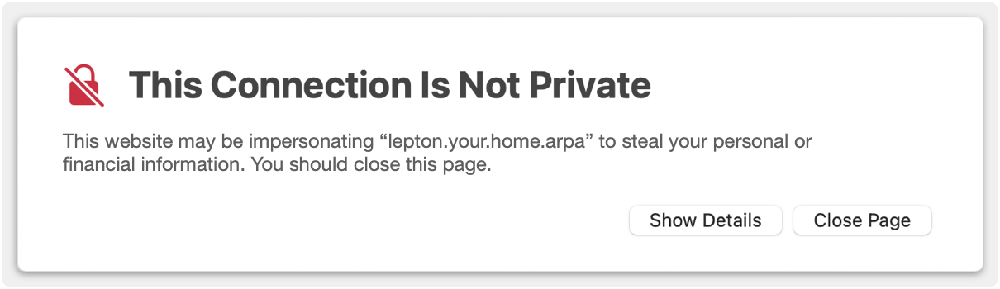

# Private SSL certificates for Proxmox servers

## scenario

You have installed Proxmox-VE on a computer. You have launched your browser and connected to the web-based GUI on port 8006. And you are now staring at:



You have probably been clicking <kbd>Show Details</kbd> and visiting the site anyway but, eventually, the security alert starts to become *really* annoying.

You Google the topic and search YouTube. If your experience is anything like mine, you'll find a lot of information about registering a domain, then using [Let's Encrypt](https://letsencrypt.org) and the [ACME protocol](https://datatracker.ietf.org/doc/html/rfc8555).

There is absolutely nothing wrong with that approach but it has always seemed like overkill if you are only running a small home network and you simply want that irritating message to go away.

That's what this repository is for:

* You can create a domain certificate which you can install on each of your client systems (browsers), and which will last for as long as you like (the default is 10 years).
* You can create certificates for your Proxmox-VE servers which you will only need to refresh every couple of years.
* You won't need to register and pay for a domain. You won't need to sign-up with Let's Encrypt. And you won't need to set up an ACME client to auto-renew your certificates.

As you eyeball the table of contents, you might think it's "all too hard" but it really isn't. It boils down to:

1. Run one script to create a Certificate Authority;
2. Run another script for each of your Proxmox-VE servers;
3. Install the certificate created in Step&nbsp;1 on each client where you run a browser; and
4. Install the certificate and key created in Step&nbsp;2 on the Proxmox-VE server for which it was created.

## contents

- [on the subject of a Domain](#onDomain)
- [on the subject of a DNS server](#onDNSserver)
- [about certificates](#aboutCerts)
- [example values](#exampleValues)
- [step 1 - create your CA](#makeCA)
- [step 2 - create server certificate](#makeServer)
- [what just happened?](#fileTree)
- [step 3 - browser systems](#clientSystems)

	- [macOS](#macOSclients)
	- [iOS](#iOSclients)
	- [Debian - Chromium](#debianChromium)
	- [Android and Windows](#otherClients)

- [step 4 - Proxmox-VE servers](#proxmoxSystems)

	- [via the web GUI](#proxmoxGUI)
	- [via the CLI](#proxmoxCLI)

- [scripts reference](#scriptsReference)

	- [`make_domain_certificate.sh`](#makeCAScript)
	- [`make_server_certificate.sh`](#makeServerScript)
	- [`install_server_certificate.sh`](#installServer)

- [enabling multicast DNS](#mDNSenable)
- [useful commands](#usefulCommands)
- [see also](#seeAlso)
- [acknowledgement](#acknowledgement)

<HR>

<a name="onDomain"></a>
## on the subject of a Domain

You *will* need a domain but that doesn't mean you have to register and pay for a domain if you don't need it for some other reason.

If you already own a domain, that's great. Use it.

If you don't own a domain, you can either invent one or you can adopt the `home.arpa` domain which is reserved by [RFC8375](https://datatracker.ietf.org/doc/html/rfc8375) for exactly this kind of situation.

If you decide to use `home.arpa`, I'd recommend inventing your own sub-domain. For example, if your family name is "Williams" and you live in "Burns" street, you might choose a sub-domain like one of the following:

* `williams.home.arpa`
* `burns.home.arpa`

Then your host names would be stuck on the front:

* `proxmox.williams.home.arpa`
* `proxmox.burns.home.arpa`

<a name="onDNSserver"></a>
## on the subject of a DNS server

The need to have a domain doesn't imply that you also need a Domain Name System server. Certificates work just as well with IP addresses or hostnames in `/etc/hosts`. You can also [enable multicast DNS services](#mDNSenable) on your Proxmox-VE servers and rely on the `.local` domain.

Tip:

* If you don't have your own DNS server but it has been on your to-do list for a while, then a quick way to get started is to use [Pi-hole](https://pi-hole.net). It's not just an ad-blocker, it's also a perfectly usable DNS server.

<a name="aboutCerts"></a>
## about certificates

The word "certificate" gets a lot of use. In a practical sense, a certificate is the result of binding a public key with a "subject" and signing the pairing with a private key. Although you won't find these terms in official OpenSSL documentation, this guide uses the following definitions to try to keep the concepts clear:

* **domain certificate**

	A domain certificate is a by-product of creating a Certificate Authority ("CA"). It is a **domain** certificate because the "subject" is your domain. The domain certificate is signed by the CA's private key (rather than that of another authority further up the chain of trust) so it is said to be both "self-signed" and a "root certificate".

	Your CA is also used to sign your *server certificates* (which are discussed next). When you make your *domain certificate* available to a browser **and** explicitly mark it as trusted, the browser will implicitly trust any **server certificates** that were signed by your CA.

* **server certificate**

	A server certificate is a non-root certificate which is signed by your CA. It is a **server** certificate because the "subject" is the server's fully-qualified domain name. The certificate attests that the Proxmox-VE server is what it claims to be. You install the server certificate and server private key on the Proxmox-VE server for which it was generated.

<a name="exampleValues"></a>
## example values

The examples in this guide assume:

* Your domain is `your.home.arpa`

* You have two Proxmox-VE servers:

	| Hostname | Domain Name (FQDN)   | IP Address      |
	|----------|----------------------|-----------------|
	| wazza    | wazza.your.home.arpa | 192.168.203.100 |
	| jacka    | jacka.your.home.arpa | 192.168.203.101 |

You can substitute your own domain, hostnames and IP addresses wherever you see those values. Fairly obviously, the IP Address should reach your Proxmox-VE server. Less obviously, the hostname should always be the same name that your Proxmox-VE server reports when you run:

``` console
$ echo $HOSTNAME
```

<a name="makeCA"></a>
## step 1 - create your CA

A Certificate Authority (CA) is something that can be used to sign your server certificates. It consists of a private key plus a domain certificate which can be installed on clients where you run a browser (we'll get to that in [Step&nbsp;3](#clientSystems)).

To create your CA, run this command:

``` console
$ ./make_domain_certificate.sh your.home.arpa
```

The expected response is:

```
Generating private key for your.home.arpa Certificate Authority
Creating self-signed certificate for the your.home.arpa domain
```

The single domain certificate created in this step will cover **all** of your Proxmox-VE servers, whether they exist now or are barely a gleam in your eye.

<a name="makeServer"></a>
## step 2 - create server certificates

You need to generate a private key and matching server certificate for each of your Proxmox-VE servers. Each server certificate is signed by your Certificate Authority. In [Step&nbsp;4](#proxmoxSystems) we'll install these credentials on the Proxmox-VE server for which they were generated.

Run this command:

``` console
$ ./make_server_certificate.sh wazza your.home.arpa 192.168.203.100
```

The expected response is:

```
Generating private host key for wazza.your.home.arpa
Generate Certificate Signing Request (CSR) for wazza.your.home.arpa
Generating server certificate for wazza.your.home.arpa
Certificate request self-signature ok
subject=CN=wazza.your.home.arpa
```

If you are operating more than one Proxmox-VE server, you will need to run this command for each server. Let's assume there's a second server called "jacka" and run the command for it:

``` console
$ ./make_server_certificate.sh jacka your.home.arpa 192.168.203.101
```

<a name="fileTree"></a>
## what just happened?

The scripts created the directory structure shown in [Figure 1](#figure1).

| <a name="figure1"></a>Figure 1: Basic directory structure |
|:---------------------------------------------------------:|
|  |

A "domain directory" is created which is named for your domain. The domain directory contains a `CA` directory for your Certificate Authority. The `CA` directory contains:

* a file ending in `.crt` which is a self-signed PEM-format domain certificate. This is the file you need to install ([Step&nbsp;3](#clientSystems)) on any client machine with a browser which will connect to your Proxmox-VE servers.
* a file ending in `.der` which is a copy of the `.crt` converted to DER format. This is a convenience and should only be used if your client system won't accept the `.crt`. Otherwise, it should be ignored.
* a file ending in `.key` which is the PEM-format private key associated with your Certificate Authority. This file should be kept reasonably secure.
* a file ending in `.srl` which is used by OpenSSL for managing certificate serial numbers. You should leave this file alone.

The domain directory also contains a `servers` directory. The `servers` directory contains one sub-directory for each of your Proxmox-VE servers. Each server's sub-directory contains:

* a file named `pveproxy-ssl.key` which is the PEM-format private key generated for that specific Proxmox-VE server.
* a file named `pveproxy-ssl.pem` which is the PEM-format server certificate for that specific Proxmox-VE server. The server certificate is signed by your Certificate Authority.
* a file ending in `.csr` which is an intermediate file containing the certificate signing request. You should leave this file alone.

The filenames `pveproxy-ssl.key` and `pveproxy-ssl.pem` are pre-defined by Proxmox-VE so you should not rename them. These files need to be copied to your Proxmox-VE server and installed. We'll do that in [Step&nbsp;4](#proxmoxSystems).

To set the scene, [Figure 2](#figure2) summarises which files get installed on your various hosts.

| <a name="figure2"></a>Figure 2: what gets installed and where |
|:-------------------------------------------------------------:|
|     |

<a name="clientSystems"></a>
## step 3 - browser systems

Each server certificate contains *almost* everything a browser needs to confirm that the server is what it claims to be. The missing element is the CA's public key, which provides assurance that the server certificate was signed by the CA's private key.

The CA's public key is contained in the domain certificate. You need to install the domain certificate on each client system where you want to use a browser to reach the Proxmox-VE GUI running on your server.

The domain certificate needs to be somewhere that the browser can find it. This is the tricky bit because what you need to do depends on your client operating systems and/or your browsers. There is no one-size-fits-all approach (but you shouldn't blame OpenSSL for this problem).

The good news is that a single domain certificate covers all the Proxmox-VE servers you care to spin up. Plus, if you accepted the default lifetime of 10 years when you created the certificate, you won't have to update it very often.

<a name="macOSclients"></a>
### macOS

Installation on macOS is handed via the Keychain. The process is summarised in [Figure 3](#figure3).

| <a name="figure3"></a>Figure 3: macOS installation using Keychain Access |
|:------------------------------------------------------------------------:|
|       |

The steps are:

1. Click on the Launchpad then start typing "Keychain" until you can see the "Keychain Access" application. Launch it.

	> Alternatively, you can find "Keychain Access" in the Utilities folder inside your Applications folder.

2. In the left hand panel, select your "login" key chain <!--A-->&#x1F130;, and then select the "Certificates" tab <!--B-->&#x1F131;.
3. Drag the domain certificate (eg `your.home.arpa.crt`) and drop into the "Keychain Access" panel.

	> Alternatively, you can open the "File" menu and choose "Import Items…", and import the certificate that way.

	You will see something similar to <!--C-->&#x1F132;. Note how the certificate carries a red-X badge indicating that it is untrusted. This fact is also stated explicitly at <!--D-->&#x1F133;.

4. Either double-click the certificate <!--C-->&#x1F132; or single-click the certificate to select it, then choose "Get Info" from the "File" menu.
5. Click the disclosure triangle <!--E-->&#x1F134; next to "Trust" to expand that grouping.
6. Change the "When using this certificate:" popup menu <!--F-->&#x1F135; to "Always Trust".
7. Close the dialog by clicking <!--G-->&#x1F136;. The system will prompt for administrator credentials, after which the domain certificate will be marked trusted.
8. Quit "Keychain Access".

As far as I am aware, a domain certificate installed in your login keychain will work for all browsers on your login account. I have tested Safari, Chrome, Chromium-Gost, and Firefox.

> I have not tried adding a domain certificate to the system keychain but, in principle, it should work and result in the domain certificate being available to all accounts on your system.

<a name="iOSclients"></a>
### iOS

The simplest way to get started is to email your domain certificate (eg `your.home.arpa.crt`) to a mailbox that you can access from your iOS device.

[Figure 4](#figure4) summarises the installation process.

| <a name="figure4"></a>Figure 4: iOS installation starting from Mail |
|:-------------------------------------------------------------------:|
|         |

The steps are:

1. Launch Mail <!--A-->&#x1F130; and select the account to which you sent the domain certificate.
2. Select the message <!--B-->&#x1F131; containing the attached domain certificate, then tap on the attachment's icon <!--C-->&#x1F132; (not the download symbol). iOS responds with a dialog telling you the profile has been downloaded. Tap <kbd>Close</kbd> <!--D-->&#x1F133;.
3. Switch to the System Settings app <!--E-->&#x1F134;. Near the top of the left-hand panel is a temporary category named "Profile Downloaded" <!--F-->&#x1F135;. Tap that.
4. A sheet slides in where you can see the certificate details. Tap the <kbd>Install</kbd> button <!--G-->&#x1F136; and follow the process to completion by tapping <kbd>Install</kbd> three more times (<!--H-->&#x1F137;, <!--I-->&#x1F138; and <!--J-->&#x1F139;). Depending on your settings, iOS may prompt you to authenticate.
5. At the top level of of "System Settings", tap <kbd>General</kbd> <!--K-->&#x1F13A;, then <kbd>About</kbd> <!--L-->&#x1F13B;.
6. Find and tap <kbd>Certificate&nbsp;Trust&nbsp;Settings</kbd> <!--M-->&#x1F13C; (it's near the bottom of the list).
7. A sheet opens where you can see the name of the domain certificate you have just installed. Turn on the switch <!--N-->&#x1F13D; and acknowledge the alert <!--O-->&#x1F13E; to enable full trust. Depending on your settings, iOS may also prompt you to authenticate.

<a name="debianChromium"></a>
### Debian - Chromium

Linux browsers maintain their own trust stores so you need to install your domain certificate on a per-browser basis. 

Before you begin, make sure the domain certificate has been copied to your home directory on the Linux host where Chromium is running. One way of doing that is:

``` console
$ scp your.home.arpa/CA/your.home.arpa.crt «user»@«host».«domain»:.
```

[Figure 5](#figure5) summarises the installation process for the Chromium browser. Other browsers may differ in the details but will likely have similar steps.

| <a name="figure5"></a>Figure 5: Debian - Chromium browser installation    |
|:-------------------------------------------------------------------------:|
| |

1. Launch Chromium.
2. Click the <kbd><!--v.ellipsis-->&#x22EE;</kbd> button <!--A-->&#x1F130; at the end of the URL bar to "Customize and control Chromium" and choose "Settings" <!--B-->&#x1F131;.
3. Click the "Main menu" aka "hamburger" button <kbd><!--hamburger-->&#x2630;</kbd> <!--C-->&#x1F132; and choose "Privacy and security" <!--D-->&#x1F133;.
4. Click the "Security" grouping <!--E-->&#x1F134;.
5. Scroll down until you see "Manage certificates" <!--F-->&#x1F135; then click on that grouping.
6. Click on the "Authorities" tab <!--G-->&#x1F136;.
7. Click the <kbd>Import</kbd> button <!--H-->&#x1F137; and navigate to your home directory or the directory where you uploaded the domain certificate.
8. Select `your.home.arpa.crt` <!--I-->&#x1F138; and click <kbd>Select</kbd> <!--J-->&#x1F139;.
9. Turn on the "Trust this certificate for identifying websites" option <!--K-->&#x1F13A;, then click <kbd>OK</kbd> <!--L-->&#x1F13B;.
10. Close the tab.

The domain certificate is now installed and trusted <!--M-->&#x1F13C;.

<a name="otherClients"></a>
### Android and Windows

I'm sorry but I don't use either platform so I can't help. You will, unfortunately, have to figure this bit out for yourself. Google is your friend.

<a name="proxmoxSystems"></a>
## step 4 - Proxmox-VE servers

You need to install a server certificate and private key on each Proxmox-VE server. You have two choices:

1. Use the [Proxmox-VE web GUI](#proxmoxGUI); or
2. Use the [command line interface](#proxmoxCLI).

The results are the same no matter which approach you choose.
 
Whenever you need to regenerate your server certificate, you can use the same method to upload the newer server certificate and it will replace the existing one.

<a name="proxmoxGUI"></a>
### via the web GUI

[Figure 6](#figure6) summarises the certificate installation process using the web GUI.

| <a name="figure6"></a>Figure 6: Proxmox-VE - add via GUI |
|:--------------------------------------------------------:|
|    |

The steps are:

1. Connect to the server on port 8006. Push past any SSL security alert and login to the Proxmox-VE server GUI as the root user.
2. Switch to "Server View" <!--A-->&#x1F130; then expand the "Datacenter" <!--B-->&#x1F131; and click on the name of your server <!--C-->&#x1F132; to select it.
3. In the middle panel, find the "System" group <!--D-->&#x1F133; and, if necessary, click on its title to expand the group.
4. Click "Certificates" <!--E-->&#x1F134;. The right hand panel changes to show you the certificate and key which are generated automatically by Proxmox-VE.
5. Click the <kbd>Upload&nbsp;Custom&nbsp;Certificate</kbd> button <!--F-->&#x1F135;. This opens a dialog box.
6. Click the upper <kbd>From&nbsp;File</kbd> button <!--G-->&#x1F136;. This opens a file-selection picker (not shown). Navigate to the directory where your server's private key and certificate are stored, select the server's private key, and click the <kbd>Upload</kbd> button. For example:

	```
	«path»/your.home.arpa/servers/wazza/proxmox-ssl.key
	``` 

7. Repeat the process with the lower <kbd>From&nbsp;File</kbd> button <!--H-->&#x1F137;, this time selecting your server's certificate. For example:

	```
	«path»/your.home.arpa/servers/wazza/proxmox-ssl.pem
	```

8. Click the <kbd>Upload</kbd> button <!--I-->&#x1F138;.

The Proxmox interface will restart and you may need to reload your browser window. If you have been following these instructions in the order shown, your browser will already have access to your domain certificate so you should be able to connect to your Proxmox-VE server without facing any "This Connection Is Not Private" alerts.

<a name="proxmoxCLI"></a>
### via the CLI

On the system where you generated the server certificate and private key, copy those artifacts plus the installer script to the target Proxmox-VE host. For example:

``` console
$ scp install_server_certificate.sh \
      your.home.arpa/servers/wazza/pveproxy-ssl.* \
      «user»@wazza.your.home.arpa:.
```

Connect to the target Proxmox-VE host. For example:

``` console
$ ssh «user»@wazza.your.home.arpa 
```

When you install a Proxmox-VE server from its distribution media, the installer defaults to creating the `root` user. Security professionals generally recommend creating a primary and backup user with `sudo` privileges, and then disabling the root account for normal login via SSH or at the console. Thus, whether you connect as root or as some other privileged user will depend on your circumstances.

If you did **not** connect as the root user, you need to become root, like this:

``` console
$ sudo -s
#
```

> Note the change of system prompt from `$` to `#` indicating you are root. Also, please do not assume you can ignore the above step and simply use `sudo` to run the next command. It will not work. 

Run the installer script:

``` console
# ./install_server_certificate.sh
```

Press <kbd>control</kbd>+<kbd>d</kbd> (either once or twice) to logout.

You may need to reload your browser window. If you have been following these instructions in the order shown, your browser will already have access to your domain certificate so you should be able to connect to your Proxmox-VE server without facing any "This Connection Is Not Private" alerts.

<a name="scriptsReference"></a>
## scripts reference

<a name="makeCAScript"></a>
### `make_domain_certificate.sh`

This command creates a Certificate Authority for your domain. The usage is:

``` console
$ ./make_domain_certificate.sh «domain» {«days»}
```

The first time you run this script, it generates a private key plus a self-signed domain certificate for your Certificate Authority (CA). Providing you don't delete the private key, you can re-run the same command to extend the lifetime of your domain certificate.

The default lifetime of the domain certificate created by this script is 3650 days (ten years). You can, if you wish, set a different lifetime by passing an optional argument in days. For example, to set a lifetime of one year:

``` console
$ ./make_domain_certificate.sh your.home.arpa 365
```

All that happens is the validity period of the domain certificate changes to start from "now" and expire after as many days as you specify.

The script also maintains a copy of the domain certificate in DER format. This is a convenience but should really only be used if your client system won't accept the `.crt` in PEM format.

<a name="makeServerScript"></a>
### `make_server_certificate.sh`

This command creates the required files for installation on your Proxmox-VE server. It must be run **after** `make_domain_certificate.sh`. The usage is:

``` console
$ ./make_server_certificate.sh «hostname» «domain» «ipAddr» {«days»}
```

The first time you run this script, it generates a private key for your Proxmox-VE server, plus a server certificate which is signed by your Certificate Authority. 

The default lifetime of the server certificate created by this script is 730 days (two years). You can, if you wish, set a different lifetime providing it is within the range 1…825 days. If you set a lifetime longer than 825 days (2 years, 3 months) your browser may complain that your server certificate is not standards compliant.

Providing you don't delete either the Certificate Authority files or the server's private key, you can re-run the same command to extend the lifetime of your server's certificate. For example, to set a lifetime of 90 days:

``` console
$ ./make_server_certificate.sh wazza your.home.arpa 192.168.203.100 90
```

All that happens is the validity period of the server certificate changes to start from "now" and expire after as many days as you specify.

<a name="installServer"></a>
### `install_server_certificate.sh`

Preconditions:

1. You must be root to run this script. You either need to login to your Proxmox-VE server as root or become root using this command:

	``` console
	$ sudo -s
	```

2. The files `pveproxy-ssl.key` and `pveproxy-ssl.pem` (respectively, the Proxmox-VE server's private key and certificate) must be present in the working directory.
3. The subject of the server certificate represented by `pveproxy-ssl.pem` must match the value of `$HOSTNAME`.

Usage:

``` console
# ./install_server_certificate.sh
```

> The leading `#` is not a comment. It indicates that you must be running as the root user before executing this command.

The script checks for the presence of `pveproxy-ssl.key` and `pveproxy-ssl.pem`, changes their ownership and mode to meet installation requirements,  confirms that the server certificate is intended for the host on which script is running, then moves both files into:

```
/etc/pve/nodes/${HOSTNAME}/
```

This implicitly replaces any older versions of the files. The script then activates the newly-installed SSL components by calling:

```
systemctl restart pveproxy
```

<a name="mDNSenable"></a>
## enabling multicast DNS

The server certificate generated by [make_server_certificate.sh](#makeServerScript) is valid for the specific server's:

* IP address (eg `192.168.203.100`)
* Host name (eg `wazza`)
* Fully qualified domain name (eg `wazza.your.home.arpa`)
* Multicast domain name (eg `wazza.local`)

By default, Proxmox-VE does not install the multicast Domain Name System (mDNS) daemon. If you want to correct that:

``` console
$ sudo apt update
$ sudo apt install -y avahi-daemon 
```

Once mDNS services are available, you can also reach the Proxmox-VE server GUI at:

```
https://wazza.local:8006
```

<a name="usefulCommands"></a>
## useful commands

1. Display a certificate:

	``` console
	$ openssl x509 -noout -text -in «file»
	```

	where `«file»` is one of the following examples:

	* `your.home.arpa/CA/your.home.arpa.crt` (domain certificate)
	* `your.home.arpa/servers/wazza/pveproxy-ssl.pem` (server certificate)

2. Extract the public key from a certificate:

	``` console
	$ openssl x509 -pubkey -noout -in «file»
	```

	where `«file»` is one of the following examples:

	* `your.home.arpa/CA/your.home.arpa.crt` (domain certificate)
	* `your.home.arpa/servers/wazza/pveproxy-ssl.pem` (server certificate)

3. Extract the subject from a certificate:

	``` console
	$ openssl x509 -subject -noout -in «file» 
	```

	where `«file»` is one of the following examples:

	* `your.home.arpa/CA/your.home.arpa.crt` (domain certificate)
	* `your.home.arpa/servers/wazza/pveproxy-ssl.pem` (server certificate)

	Recall that a [*certificate*](#aboutCerts) binds a public key with a subject and signs the pairing with a private key. This command extracts the subject; the previous command, the public key.
	
4. Verify a certificate chain offline:

	``` console
	$ openssl verify -show_chain -CAfile «domainCert» «serverCert»
	```

	where:

	* `«domainCert»` is the path to your domain certificate, such as:

		```
		your.home.arpa/CA/your.home.arpa.crt
		```

	* `«serverCert»` is the path to your server certificate, such as:

		```
		your.home.arpa/servers/wazza/pveproxy-ssl.pem
		```

	Note that this command will always report that your server certificate is untrusted, which is correct. The trust of a server certificate is *implied* when you install the domain certificate in a place where your **browser** (not this `openssl` command) can see it **and** affirm that you trust the domain certificate.

5. Verify a certificate chain online:

	``` console
	$ echo -n | \
	  openssl s_client -showcerts \
	    -CAfile «domainCert» \
	    -connect «URL»:8006
	```

	where:

	* `«domainCert»` is the path to your domain certificate, such as:

		```
		your.home.arpa/CA/your.home.arpa.crt
		```

	* `«URL»` is any mechanism for reaching your Proxmox-VE server, such as the server's:

		- fully-qualified domain name (eg `wazza.your.home.arpa`)
		- host name (eg `wazza`)
		- IP address (eg `192.168.203.100`)
		- multicast domain name (eg `wazza.local`)

	Notes:

	1. The host name and IP address forms will complain about "Can't use SSL_get_servername" but this is normal and should be ignored.
	2. The `echo -n` piped to the `openssl` command stops it from hanging. If you omit that element, you will need to press <kbd>control</kbd>+<kbd>d</kbd>. 

6. Display a certificate signing request:

	``` console
	$ openssl req -noout -text -in your.home.arpa/servers/wazza/wazza.csr
	```

7. Convert a certificate in PEM format to DER format:

	``` console
	$ openssl x509 -inform pem -in «infile» -outform der -out «outfile»
	```

	where `«infile»` is one of the following examples:

	* `your.home.arpa/CA/your.home.arpa.crt` (domain certificate)
	* `your.home.arpa/servers/wazza/pveproxy-ssl.pem` (server certificate)

	and `«outfile»` should be the same as `«infile»` but replacing the `.crt` or `.pem` extension with `.der`, as in:

	* `your.home.arpa/CA/your.home.arpa.der` (domain certificate)
	* `your.home.arpa/servers/wazza/pveproxy-ssl.der` (server certificate)

	Note that `make_domain_certificate.sh` already generates a DER-format CA certificate for you as a convenience. Proxmox-VE servers expect and accept PEM-format server certificates so there really should not be any need to convert those.

<a name="seeAlso"></a>
## see also

* [OpenSSL Documentation](https://docs.openssl.org/3.0/man1/)
* [GoLinuxCloud OpenSSL Cheat Sheet](https://www.golinuxcloud.com/openssl-cheatsheet/)
* [SSL.com Knowledgebase](https://www.ssl.com/info/)

<a name="acknowledgement"></a>
## acknowledgement

Although the scripts in this repository only bear a passing resemblance to the script at the URL below, it did have a significant effect on my approach to the problem so I'm citing it as a source:

* [`provision-pveproxy-certificate.sh`](https://github.com/rgl/proxmox-ve/blob/master/example/provision-pveproxy-certificate.sh) from [github.com/rgl/proxmox-ve](https://github.com/rgl/proxmox-ve)

There is nothing wrong with that script but I found that the self-signed server certificates it produces would not work properly on iOS. They were not "root certificates" and trust could not be enabled, which kinda defeats the purpose.
